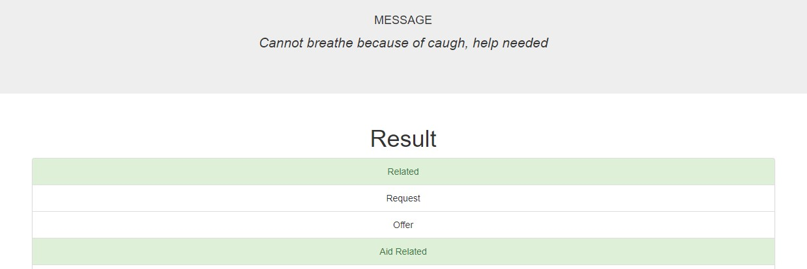
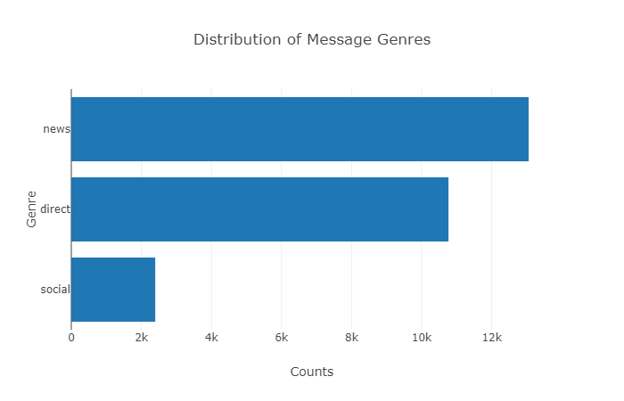

# Disaster Response Pipeline

### Project Motivation
In this project, disaster data obtained from Figure Eight will be analyzed and a classifier model will be developed to classify the messages for facilitating faster response from the various emergency teams. The dataset contains pre-labelled tweet and messages from real-life disaster events. The objective of the project is to build a Natural Language Processing (NLP) model to categorize messages on a real time that can be relayed to appropriate emergency response teams to take necessary actions.

### Brief Overview of the Processes
1. ETL Process  
    There are two datasets: one containing the messages and the other containing the labels i.e. categories of disaster response. The two datasets were merged and categories data were transformed. Next, the data were normalized, cleaned and stored into SQLite database for future use.

2. Training Model  
    A classification model was trained for classifying the messages with the help of NLP processes and scikit-learn library. The train model was stored into a pickle (.pkl) file.

3. Run the Web App  
    Lastly, the model were deployed on the web for real time message classification.

### Description of Files
To create end-to-end solution, the project adhere to the three steps of data analysis and the files are organized into the steps they belong to.
1. ETL Process (Data Preprocessing): `data` 
2. Training Models (Data Processing): `models`
3. Create Dashboard (Data Postprocessing): `app`

```
- app
| - template
| |- master.html            # main page of web app
| |- go.html                # classification result page of web app
|- run.py                   # Flask file that runs app

- data
|- disaster_categories.csv  # data to process 
|- disaster_messages.csv    # data to process
|- process_data.py          # ETL Script
|- DisasterResponse.db      # database to save clean data to

- models
|- train_classifier.py      # ML Script
|- classifier.pkl           # saved model 

- README.md
- LICENSE
```

### Instructions
1. Run the following commands in the project's root directory to set up your database and model.  
    - To run ETL pipeline that cleans data and stores in database:  
        `python data/process_data.py data/disaster_messages.csv data/disaster_categories.csv data/DisasterResponse.db`
    - To run ML pipeline that trains classifier and saves model:  
        `python models/train_classifier.py data/DisasterResponse.db models/classifier.pkl`  
2. Run the following command in the app's directory to run your web app.  
        `python run.py`  
3. Go to http://0.0.0.0:3001/

### Improvements
The model is a RandomForest classifier and it takes about couple of hours to train the model. Furthermore, if the number of feature i.e. number of tress are more than 150, the training process out of memory. Since the problem is a multiclass multioutput problem, **Multinomial Naive Bayes** classifier can significantly improve the training performance with comparatively similar model performance.

### Required Libraries
1. Pandas, Sciki-Learn
2. NLTK
3. SQLalchemy
4. Pickle
5. Flask, Plotly

### Example of the Dashboard
  



### Acknowledgement
- [Figure Eight](https://appen.com/) (They have been acquired by Appen)
- [Udacity](https://www.udacity.com/)